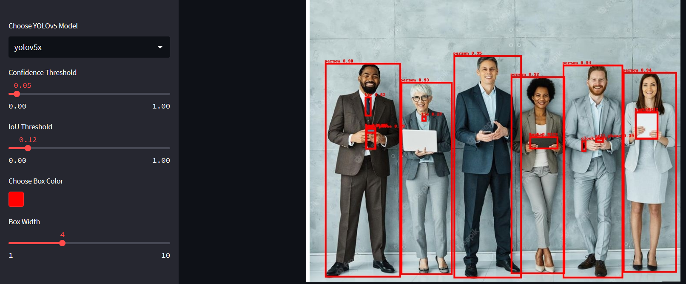

# Détection d'Objets avec YOLOv5 et Streamlit
Ce projet présente une application web interactive construite avec Streamlit qui utilise le modèle d'apprentissage profond YOLOv5 pour la détection d'objets dans des images. Les utilisateurs peuvent télécharger des images, et l'application affichera les images avec des cadres dessinés autour des objets détectés, accompagnés de leurs noms de classes et scores de confiance.



## Fonctionnalités
* Interface Web Interactive :Construite avec Streamlit, offrant une expérience utilisateur intuitive.
* Sélection du Modèle : Choisissez entre différents modèles YOLOv5 (yolov5s, yolov5m, yolov5l, yolov5x) pour équilibrer vitesse et précision.
* Paramètres de Détection Personnalisables : Ajustez les seuils de confiance et d'IoU pour affiner les résultats de détection.
* Résultats en Temps Réel : Téléchargez des images et visualisez les résultats de détection en temps réel, avec les objets détectés mis en évidence.
* Comptage des Objets : Fournit un comptage des objets détectés classés par catégorie.
## Installation
Pour exécuter cette application, Python doit être installé sur votre système. Ensuite, installez les bibliothèques requises en utilisant la commande suivante :


```bash
pip install streamlit torch numpy Pillow
```


### Utilisation
* Clonez ce dépôt sur votre machine locale.
* Naviguez jusqu'au répertoire cloné.
* Exécutez l'application avec Streamlit :

```bash
streamlit run detection_v5.py
```

L'interface Streamlit devrait s'ouvrir dans votre navigateur web par défaut, où vous pourrez interagir avec l'application.
## Fonctionnement
* Chargement du Modèle : La fonction load_model charge dynamiquement un modèle YOLOv5 spécifié depuis le dépôt Ultralytics.
* Exécution de la Détection : La fonction run_detection_image traite les images téléchargées, effectuant la détection d'objets en utilisant le modèle YOLOv5 sélectionné.
* Dessin des Cadres : Les objets détectés sont mis en évidence avec des cadres, dessinés sur les images à l'aide de la fonction draw_boxes.
* Comptage des Classes : La fonction count_classes fournit un résumé des objets détectés, classés par catégorie.
##  Personnalisation de l'Application
* Sélection du Modèle : Choisissez une variante du modèle YOLOv5 qui correspond à vos besoins en termes de vitesse ou de précision.
* Seuils de Détection : Ajustez les seuils de confiance et d'IoU dans la barre latérale pour optimiser les résultats de détection pour votre cas d'utilisation spécifique.
* Apparence des Cadres : Personnalisez la couleur et la largeur des cadres pour améliorer la visibilité sur vos images.
## Contribution
Les contributions à ce projet sont les bienvenues ! Que ce soit pour des corrections de bugs, des améliorations de fonctionnalités ou des améliorations de la documentation, n'hésitez pas à soumettre une demande de tirage (pull request).

Licence
Ce projet est ouvert sous la Licence MIT

Profitez de l'exploration de la détection d'objets avec YOLOv5 et Streamlit, et n'hésitez pas à partager vos commentaires ou suggestions pour rendre ce projet encore meilleur !